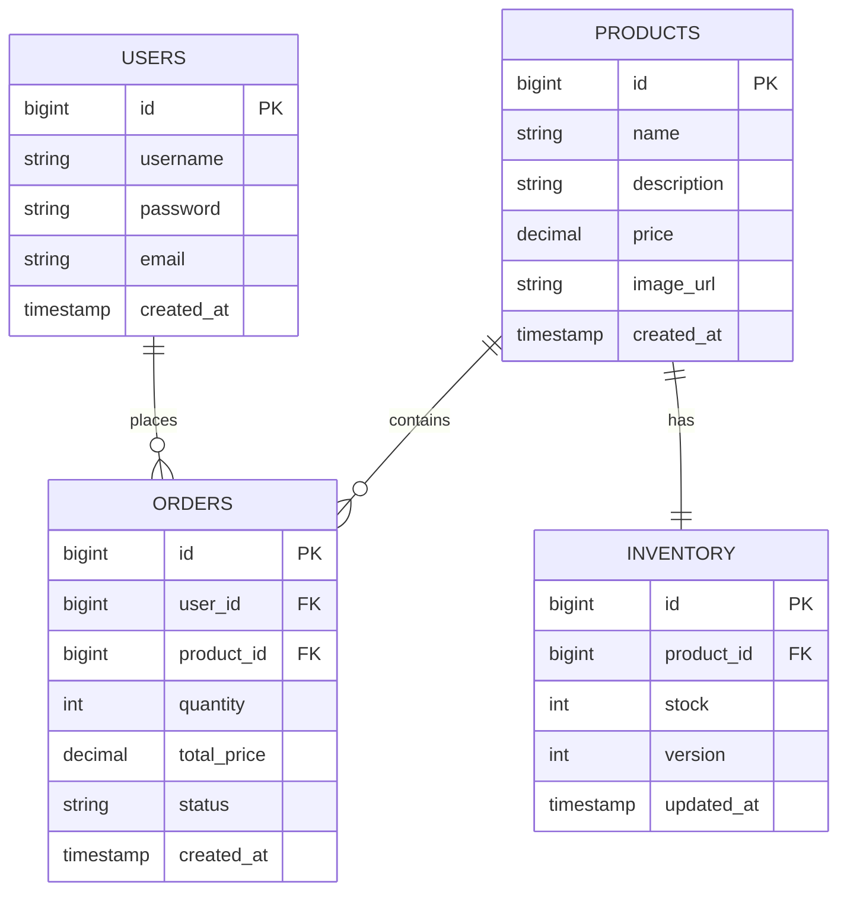

# 分布式系统作业：商品库存及秒杀系统设计

本项目在原有的高并发读基础架构之上，进一步实现了简单的商品库存及秒杀系统基础功能，包括用户注册登录、商品展示等，并完成了系统设计文档。

## 1. 系统架构设计

系统采用分层架构设计，逻辑上拆分为用户服务、商品服务、订单服务和库存服务。目前物理部署上运行在同一个 Spring Boot 应用容器中，通过 Nginx 进行负载均衡。

### 前后端分离与动静分离
- **前端架构**: 使用 HTML5 + CSS3 + **Vue 3 (CDN)** 实现。无需像传统前端工程那样使用 Webpack/Vite 单独启动 Node.js 服务器。
- **静态资源托管**: 前端页面和静态文件（图片、样式）完全由 **Nginx** 容器直接托管。Nginx 将本机 `./static` 目录挂载到容器内部提供服务。
- **API 反向代理**: 前端向 `/api/*` 发起的请求，由 Nginx 拦截并负载均衡转发至后端的 Spring Boot 实例。

```mermaid
graph TD
    User[用户/浏览器] --> Nginx[Nginx 负载均衡]
    Nginx --> |静态资源访问| Static[挂载的静态文件 (HTML/Vue/CSS)]
    Nginx --> |/api 请求| AppCluster[后端服务集群]
    
    subgraph "后端服务 (Spring Boot)"
        AppCluster --> UserController[用户服务]
        AppCluster --> ProductController[商品服务]
        AppCluster --> OrderController[订单服务]
        AppCluster --> InventoryController[库存服务]
    end
    
    UserController --> MySQL[(MySQL 数据库)]
    ProductController --> MySQL
    OrderController --> MySQL
    InventoryController --> MySQL
```

### 服务职责
- **用户服务**: 处理用户注册、登录、鉴权。
- **商品服务**: 商品信息的增删改查。
- **库存服务**: 管理商品库存，处理库存扣减（乐观锁）。
- **订单服务**: 处理下单逻辑，创建订单。

## 2. 数据库设计 (ER图)



### 数据库持久化说明
在 `docker-compose.yml` 中，我们使用了 **绑定挂载 (Bind Mount)** 的方式将数据库内容持久化到宿主机的物理磁盘：
- 宿主机路径：`D:/学习资料/distributed_system/distributed_data/mysql`
- 容器内路径：`/var/lib/mysql`

这意味着，即使您删除了 MySQL 容器，所有的表结构和数据都安全地存储在您的 D 盘目录下。当下次启动容器时，它会重新读取这些数据。

## 3. 技术栈选型

| 组件 | 选型 | 说明 |
| :--- | :--- | :--- |
| **编程语言** | Java 17 | 长期支持版本，性能优异 |
| **Web 框架** | Spring Boot 3.2.3 | 快速开发，自动配置 |
| **ORM 框架** | MyBatis-Plus 3.5.5 | 简化 SQL 操作，提供强大的 CRUD 能力 |
| **数据库** | MySQL 8.0 | 稳定可靠的关系型数据库 |
| **容器化** | Docker & Docker Compose | 环境隔离，一键部署 |
| **负载均衡** | Nginx | 反向代理，静态资源服务器 |
| **前端** | HTML5 + CSS3 + Vanilla JS | 原生开发，轻量级 |

## 4. API 接口文档

### 用户模块 (User)

| 接口 | 方法 | URL | 参数 | 说明 |
| :--- | :--- | :--- | :--- | :--- |
| **登录** | POST | `/api/users/login` | `{username, password}` | 用户登录 |
| **注册** | POST | `/api/users/register` | `{username, password, email}` | 用户注册 |

### 商品模块 (Product)

| 接口 | 方法 | URL | 参数 | 说明 |
| :--- | :--- | :--- | :--- | :--- |
| **列表** | GET | `/api/products` | 无 | 获取所有商品列表 |

## 5. 快速开始

### 启动服务
在项目根目录 (`homework`) 下运行：

```bash
docker-compose up -d --build
```

### 验证功能

1.  **访问登录页**: [http://localhost/static/login.html](http://localhost/static/login.html)
    -   默认账号: `admin` / `admin123`
    -   或者点击 "Register" 注册新账号。
2.  **查看商品**: 登录成功后会自动跳转到 Dashboard，查看商品列表。
3.  **数据库检查**: 连接 `localhost:3307` 查看 `users`, `products` 等表数据。

## 6. 服务连接信息与数据库管理

### DBeaver 连接 MySQL 数据库指南
如果您想使用 DBeaver 连接并管理本项目的数据库，请按照以下步骤操作：

1. 打开 DBeaver，点击左上角的 **"新建连接"** (插头图标)。
2. 在数据库列表中选择 **MySQL**，点击 "下一步"。
3. 在连接设置页面中填写以下信息：
   - **服务器地址 (Server Host)**: `localhost` 或 `127.0.0.1`
   - **端口 (Port)**: `3307` （注意不是默认的3306）
   - **数据库 (Database)**: `test_db`
   - **用户名 (Username)**: `user`
   - **密码 (Password)**: `password`
4. *(可选)* 点击 **"测试连接"** 确认配置无误。
5. 点击 **"完成"**。
连接成功后，展开 `test_db` 即可看到我们创建的 `users`, `products`, `inventory`, `orders` 表。

| 服务 | 地址 | 备注 |
| :--- | :--- | :--- |
| **MySQL (宿主机)** | `localhost:3307` | 用户: `user` / 密码: `password` |
| **Web 入口** | `http://localhost` | Nginx |
| **API 接口** | `http://localhost/api/...` | 经 Nginx 转发 |
