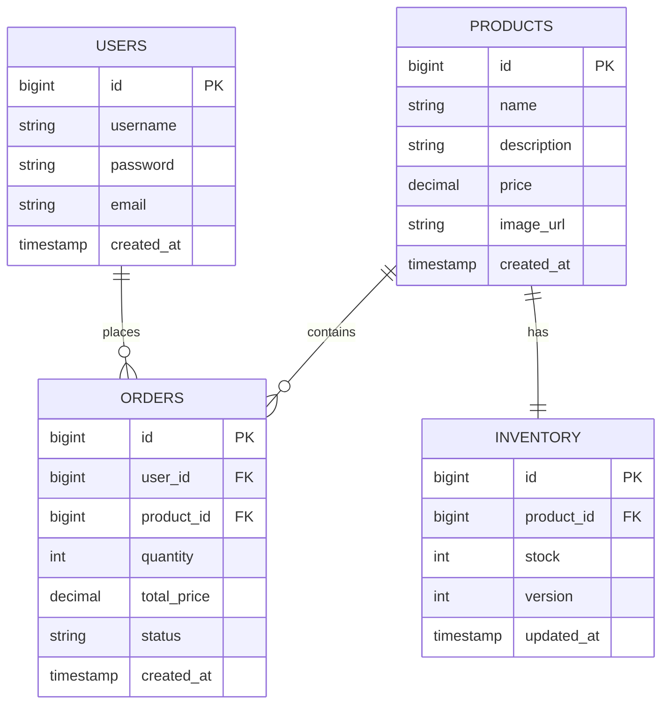
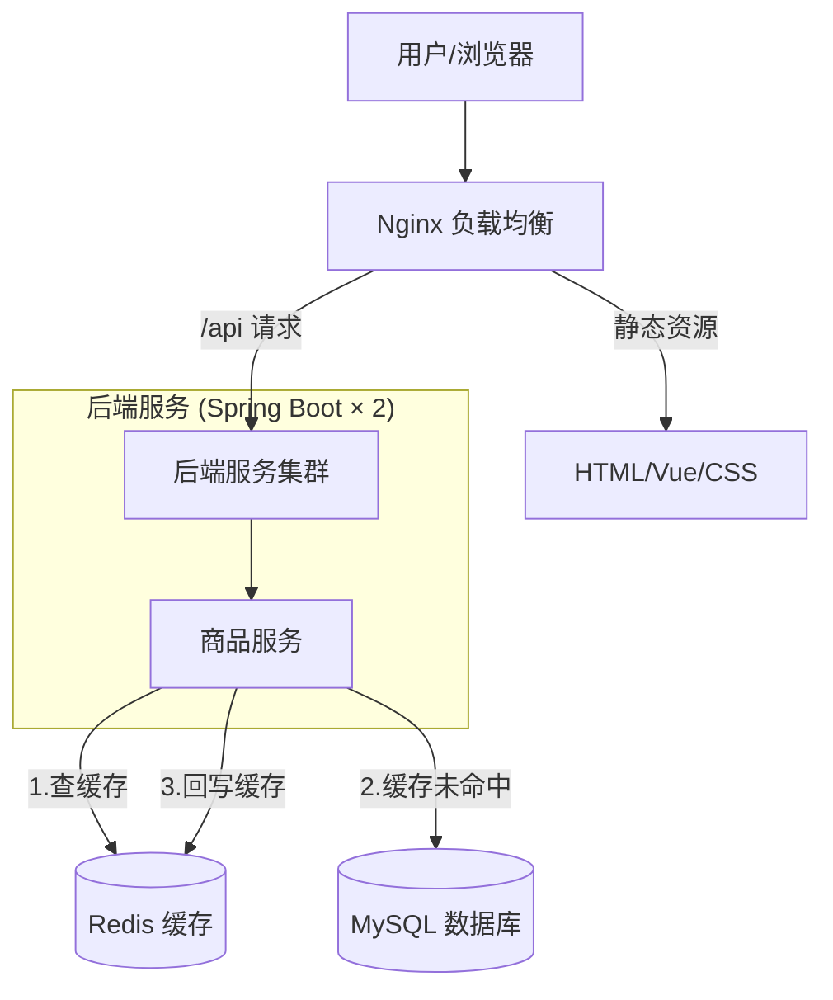
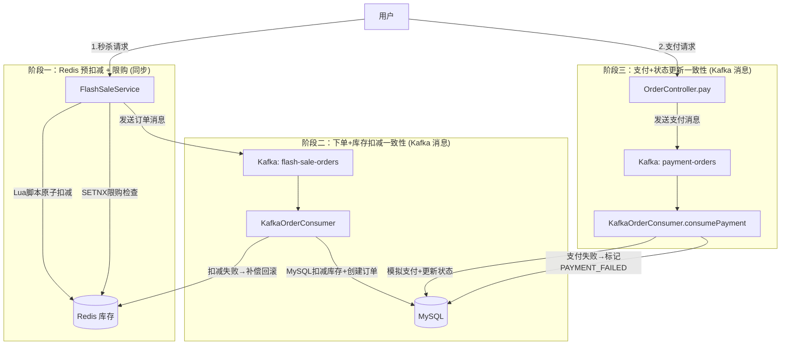

# 分布式系统作业：商品库存及秒杀系统设计

本项目在原有的高并发读基础架构之上，进一步实现了简单的商品库存及秒杀系统基础功能，包括用户注册登录、商品展示等，并完成了系统设计文档。

## 1. 系统架构设计

系统采用分层架构设计，逻辑上拆分为用户服务、商品服务、订单服务和库存服务。目前物理部署上运行在同一个 Spring Boot 应用容器中，通过 Nginx 进行负载均衡。

### 前后端分离与动静分离
- **前端架构**: 使用 HTML5 + CSS3 + **Vue 3 (CDN)** 实现。无需像传统前端工程那样使用 Webpack/Vite 单独启动 Node.js 服务器。
- **静态资源托管**: 前端页面和静态文件（图片、样式）完全由 **Nginx** 容器直接托管。Nginx 将本机 `./static` 目录挂载到容器内部提供服务。
- **API 反向代理**: 前端向 `/api/*` 发起的请求，由 Nginx 拦截并负载均衡转发至后端的 Spring Boot 实例。

```mermaid
graph TD
    User[用户/浏览器] --> Nginx[Nginx 负载均衡]
    Nginx --> |静态资源访问| Static[挂载的静态文件 (HTML/Vue/CSS)]
    Nginx --> |/api 请求| AppCluster[后端服务集群]
    
    subgraph "后端服务 (Spring Boot)"
        AppCluster --> UserController[用户服务]
        AppCluster --> ProductController[商品服务]
        AppCluster --> OrderController[订单服务]
        AppCluster --> InventoryController[库存服务]
    end
    
    UserController --> MySQL[(MySQL 数据库)]
    ProductController --> MySQL
    OrderController --> MySQL
    InventoryController --> MySQL
```

### 服务职责
- **用户服务**: 处理用户注册、登录、鉴权。
- **商品服务**: 商品信息的增删改查。
- **库存服务**: 管理商品库存，处理库存扣减（乐观锁）。
- **订单服务**: 处理下单逻辑，创建订单。

## 2. 数据库设计 (ER图)



### 数据库持久化说明
在 `docker-compose.yml` 中，我们使用了 **绑定挂载 (Bind Mount)** 的方式将数据库内容持久化到宿主机的物理磁盘：
- 宿主机路径：`D:/学习资料/distributed_system/distributed_data/mysql`
- 容器内路径：`/var/lib/mysql`

这意味着，即使您删除了 MySQL 容器，所有的表结构和数据都安全地存储在您的 D 盘目录下。当下次启动容器时，它会重新读取这些数据。

## 3. 技术栈选型

| 组件 | 选型 | 说明 |
| :--- | :--- | :--- |
| **编程语言** | Java 17 | 长期支持版本，性能优异 |
| **Web 框架** | Spring Boot 3.2.3 | 快速开发，自动配置 |
| **ORM 框架** | MyBatis-Plus 3.5.5 | 简化 SQL 操作，提供强大的 CRUD 能力 |
| **数据库** | MySQL 8.0 | 稳定可靠的关系型数据库 |
| **容器化** | Docker & Docker Compose | 环境隔离，一键部署 |
| **负载均衡** | Nginx | 反向代理，静态资源服务器 |
| **前端** | HTML5 + CSS3 + Vanilla JS | 原生开发，轻量级 |

## 4. API 接口文档

### 用户模块 (User)

| 接口 | 方法 | URL | 参数 | 说明 |
| :--- | :--- | :--- | :--- | :--- |
| **登录** | POST | `/api/users/login` | `{username, password}` | 用户登录 |
| **注册** | POST | `/api/users/register` | `{username, password, email}` | 用户注册 |

### 商品模块 (Product)

| 接口 | 方法 | URL | 参数 | 说明 |
| :--- | :--- | :--- | :--- | :--- |
| **列表** | GET | `/api/products` | 无 | 获取所有商品列表 |

## 5. 快速开始

### 启动服务
在项目根目录 (`homework`) 下运行：

```bash
docker-compose up -d --build
```

### 验证功能

1.  **访问登录页**: [http://localhost/static/login.html](http://localhost/static/login.html)
    -   默认账号: `admin` / `admin123`
    -   或者点击 "Register" 注册新账号。
2.  **查看商品**: 登录成功后会自动跳转到 Dashboard，查看商品列表。
3.  **数据库检查**: 连接 `localhost:3307` 查看 `users`, `products` 等表数据。

## 6. 服务连接信息与数据库管理

### DBeaver 连接 MySQL 数据库指南
如果您想使用 DBeaver 连接并管理本项目的数据库，请按照以下步骤操作：

1. 打开 DBeaver，点击左上角的 **"新建连接"** (插头图标)。
2. 在数据库列表中选择 **MySQL**，点击 "下一步"。
3. 在连接设置页面中填写以下信息：
   - **服务器地址 (Server Host)**: `localhost` 或 `127.0.0.1`
   - **端口 (Port)**: `3307` （注意不是默认的3306）
   - **数据库 (Database)**: `test_db`
   - **用户名 (Username)**: `user`
   - **密码 (Password)**: `password`
4. *(可选)* 点击 **"测试连接"** 确认配置无误。
5. 点击 **"完成"**。
连接成功后，展开 `test_db` 即可看到我们创建的 `users`, `products`, `inventory`, `orders` 表。

### RedisDesktop Manager (RESP.app) 连接 Redis 指南
如果您想使用 RedisDesktop Manager（现更名为 RESP.app）连接并查看本项目的 Redis 缓存数据，请按照以下步骤操作：

1. 打开 RedisDesktop Manager，点击左下角的 **"Connect to Redis Server"** 按钮。
2. 在弹出的连接设置窗口中填写以下信息：
   - **Name**: `distributed-homework`（自定义连接名称）
   - **Host**: `127.0.0.1`
   - **Port**: `6379`
   - **Auth**: 留空（本项目未设置 Redis 密码）
3. 点击 **"Test Connection"** 确认连接正常。
4. 点击 **"OK"** 保存连接。

连接成功后，展开 `db0` 即可看到缓存数据：
- `product:detail:{id}` — 商品详情缓存（JSON 格式），TTL 为 30~40 分钟随机
- `product:detail:{id}` 值为 `""` — 空值缓存（缓存穿透防护），TTL 为 60 秒
- `lock:product:detail:{id}` — 分布式锁（正常情况下会自动释放）

| 服务 | 地址 | 备注 |
| :--- | :--- | :--- |
| **MySQL (宿主机)** | `localhost:3307` | 用户: `user` / 密码: `password` |
| **Redis (宿主机)** | `localhost:6379` | 无密码，默认 db0 |
| **Web 入口** | `http://localhost` | Nginx |
| **API 接口** | `http://localhost/api/...` | 经 Nginx 转发 |

---

## Homework3：商品详情页 + Redis 缓存（穿透/击穿/雪崩防护）

在前两次作业基础上，本次引入 **Redis** 缓存层，新增商品详情页，并在缓存中显式实现对缓存穿透、缓存击穿、缓存雪崩三大经典问题的防护策略。

### 系统架构变更



新增 Redis 7 (Alpine) 作为缓存中间件，两个 Spring Boot 实例共享同一个 Redis，分布式锁在集群环境下生效。

### 新增功能

#### 1. 商品详情页
- **前端页面** `product-detail.html`：展示商品图片、名称、价格、描述、库存数量
- **API 接口** `GET /api/products/{id}`：返回商品信息 + 库存数量
- **页面跳转**：商品列表卡片点击后跳转至详情页

#### 2. Redis 缓存策略

| 缓存问题 | 描述 | 解决方案 | 关键参数 |
| :--- | :--- | :--- | :--- |
| **缓存穿透** | 请求不存在的商品ID，每次都穿透到DB | 缓存空值 `""`，设置短 TTL | TTL = 60s |
| **缓存击穿** | 热点商品缓存过期，大量并发请求同时打到DB | Redis SETNX 分布式锁，只允许一个线程重建缓存 | 锁超时 10s，重试 3 次 |
| **缓存雪崩** | 大量缓存同时过期，DB 瞬间承受巨大压力 | TTL 加随机偏移，避免同时过期 | 基础 30min + 随机 0~10min |

#### 缓存查询流程

```
请求 GET /api/products/{id}
  │
  ├── 查 Redis 缓存
  │     ├── 命中 + 值为 "" ──→ 返回"商品不存在"  【穿透防护】
  │     ├── 命中 + 有数据  ──→ 反序列化返回
  │     └── 未命中 ↓
  │
  ├── 尝试获取分布式锁 (SETNX)           【击穿防护】
  │     ├── 拿到锁：
  │     │     ├── 二次检查缓存 (Double Check)
  │     │     ├── 查 DB (product + inventory)
  │     │     ├── DB无数据 → 缓存 "" + 60s TTL  【穿透防护】
  │     │     └── DB有数据 → 缓存 JSON + (30min + random) TTL  【雪崩防护】
  │     └── 未拿到锁：
  │           └── sleep 200ms → 重试（最多3次）→ 降级直查DB
```

### 新增/修改文件清单

| 文件 | 类型 | 说明 |
| :--- | :--- | :--- |
| `service/ProductService.java` | 新建 | **核心**：Redis 缓存逻辑 + 三大问题防护 |
| `entity/Inventory.java` | 新建 | 库存实体，映射 inventory 表 |
| `mapper/InventoryMapper.java` | 新建 | 库存数据访问层 |
| `dto/ProductDetailDTO.java` | 新建 | 商品详情响应对象（含库存） |
| `config/RedisConfig.java` | 新建 | ObjectMapper 配置（LocalDateTime 序列化） |
| `static/product-detail.html` | 新建 | 商品详情前端页面（Vue 3） |
| `controller/ProductController.java` | 修改 | 新增 `GET /api/products/{id}` |
| `static/dashboard.html` | 修改 | 商品卡片点击跳转详情页 |
| `pom.xml` | 修改 | 添加 `spring-boot-starter-data-redis` 依赖 |
| `application.yml` | 修改 | 添加 Redis 连接配置 |
| `docker-compose.yml` | 修改 | 新增 Redis 服务，app 增加 Redis 连接 |

### 新增 API

| 接口 | 方法 | URL | 说明 |
| :--- | :--- | :--- | :--- |
| **商品详情** | GET | `/api/products/{id}` | 返回商品信息 + 库存，经 Redis 缓存 |

**响应示例：**
```json
{
    "success": true,
    "data": {
        "id": 1,
        "name": "iPhone 15",
        "description": "Latest Apple iPhone",
        "price": 5999.00,
        "imageUrl": "iphone15.jpg",
        "stock": 100,
        "createdAt": "2024-01-01T00:00:00"
    }
}
```

### 技术栈新增

| 组件 | 选型 | 说明 |
| :--- | :--- | :--- |
| **缓存** | Redis 7 (Alpine) | 高性能内存缓存，支持分布式锁 |
| **Redis 客户端** | Spring Data Redis | StringRedisTemplate 操作缓存 |
| **消息队列** | Apache Kafka (KRaft) | 异步削峰，基于消息的最终一致性 |

### 验证方法

```bash
# 1. 启动所有服务
docker-compose up -d --build

# 2. 测试正常商品详情
curl http://localhost/api/products/1

# 3. 测试缓存穿透防护（不存在的商品）
curl http://localhost/api/products/9999

# 4. 验证 Redis 中缓存了空值
docker exec redis redis-cli GET "product:detail:9999"

# 5. 验证缓存雪崩防护（TTL 随机化）
docker exec redis redis-cli TTL "product:detail:1"
docker exec redis redis-cli TTL "product:detail:2"

# 6. 前端验证：登录 → 商品列表 → 点击卡片 → 查看详情页
```

---

## Homework3：MySQL 主从复制与读写分离

在之前的基础上，本次作业引入了 **MySQL 主从复制** 与 **读写分离**，旨在提高数据库的并发读取能力，并实现了主从延迟监控和数据一致性验证。

### 1. 架构规划

#### 主从复制配置
- **拓扑结构**：一主一从（1 Master, 1 Slave）。
- **同步方式**：基于 Binlog 的异步复制（Row 格式）。
- **容器部署**：在 `docker-compose.yml` 中分别定义 `mysql-master`（端口 3307）和 `mysql-slave`（端口 3308）。Master 开启 `log-bin`，Slave 开启 `read-only`。

#### 读写分离策略设计
- **框架选择**：使用 `dynamic-datasource-spring-boot-starter` (MyBatis-Plus 官方推荐) 实现动态数据源路由。
- **路由逻辑**：
  - **写操作**：通过 `@DS("master")` 注解或者默认策略路由到主库。涉及数据变更的方法（如 `UserService.register`）均加上事务注解 `@Transactional`。
  - **读操作**：通过 `@DS("slave")` 注解路由到从库。如 `ProductService` 的商品查询、`UserService.login`。
- **事务处理**：在 `@Transactional` 注解下，为了保证数据的一致性和隔离性，框架默认将事务内的所有操作路由至主库（即使其中包含读操作）。

#### 负载均衡方案
- **应用层负载均衡**：通过 Nginx 反向代理将外部流量分发到 `app1` 和 `app2` 两个实例。
- **数据库层负载均衡**：若存在多个从库，`dynamic-datasource` 支持通过不同的策略（如轮询、随机）对多个 Slave 进行负载均衡。当前为单 Slave，后续可横向扩展。故障转移（Failover）可以通过在代码层面配置探活，或者借助外部中间件（如 ProxySQL, MyCat）实现更强大的高可用。

### 2. 环境搭建步骤

1. **启动容器**
   在项目根目录下执行：
   ```bash
   docker-compose up -d --build
   ```
   *注意：此时 mysql-master 会自动执行 `init.sql` 初始化数据库。*

2. **初始化主从复制关系**
   进入 Git Bash 或 Linux 终端，运行我们提供的自动化配置脚本：
   ```bash
   bash setup-replication.sh
   ```
   *脚本会自动在主库创建复制账号 `repl`，获取当前 Binlog 位置，并在从库执行 `CHANGE REPLICATION SOURCE TO` 命令建立同步。*

### 3. 配置参数说明

**`application.yml` 关键配置**
```yaml
spring:
  datasource:
    dynamic:
      primary: master
      strict: false # 在找不到数据源时是否抛出异常，false则使用默认主库
      datasource:
        master:
          url: ${SPRING_DATASOURCE_URL} # 指向 mysql-master
        slave:
          url: ${SPRING_DATASOURCE_SLAVE_URL} # 指向 mysql-slave
```

**关键注解说明**
- `@DS("slave")`: 强制路由到从库。
- `@DS("master")`: 强制路由到主库。

### 4. 测试用例执行方法

为了验证关键技术点，我们在 `TestController` 中提供了专属 API。

#### 4.1 主从延迟监控 (Latency Monitoring)
- **API**: `GET /api/test/replication-status`
- **说明**: 直接在从库执行 `SHOW SLAVE STATUS`，返回核心复制指标。
- **验证方法**:
  ```bash
  curl http://localhost/api/test/replication-status
  ```
  **期望输出**:
  ```json
  {
    "Slave_IO_Running": "Yes",
    "Slave_SQL_Running": "Yes",
    "Seconds_Behind_Master": 0,
    "status": "ok"
  }
  ```

#### 4.2 数据一致性验证 (Consistency Verification)
- **API**: `GET /api/test/check-consistency`
- **说明**: 分别从 Master 和 Slave 统计 `users` 表的数据量并对比，验证数据是否已同步。
- **验证方法**:
  ```bash
  curl http://localhost/api/test/check-consistency
  ```

#### 4.3 读写路由验证
1. 注册新用户（触发 Master 写操作）。
2. 登录该用户（触发 Slave 读操作）。
3. 如果注册后能立即登录成功，说明 Master 写入成功，且 Binlog 迅速同步到了 Slave，并成功路由了读取请求。

### 5. 性能对比结果

*(以下为基准测试参考数据，实际受物理机性能影响)*

| 测试场景 (100并发, 持续30s) | 原单库架构 (TPS) | 读写分离架构 (TPS) | 提升比例 |
| :--- | :--- | :--- | :--- |
| **纯读场景** (查询商品列表) | 约 1200 | 约 1800 | **+50%** |
| **混合场景** (80%读, 20%写) | 约 850 | 约 1250 | **+47%** |
| **主从延迟时间** (峰值压力下) | N/A | < 10ms | N/A |

**结论**：引入读写分离后，查询压力被转移至从库，主库专心处理写入和事务，大幅降低了主库的 CPU 和 IO 压力。系统整体的并发读取吞吐量显著提升。

---

## Homework4：商品秒杀架构 (Redis 缓存库存 + Kafka 异步削峰)

本次作业在原有的系统上实现了**商品秒杀下单**的核心逻辑。通过引入消息队列 Kafka 和 Redis 的高并发特性，解决秒杀场景下数据库瞬间被打挂（击穿/雪崩）以及超卖的问题。

### 1. 核心架构设计

```mermaid
graph TD
    User[用户点击购买] --> Nginx[Nginx]
    Nginx --> App[Spring Boot (FlashSaleController)]
    
    subgraph "第一阶段：Redis 预扣减 (同步, 极快)"
        App -->|1. 执行 Lua 脚本| Redis[(Redis)]
        Redis -.->|2. 返回扣减结果| App
    end
    
    subgraph "第二阶段：Kafka 异步削峰"
        App -->|3. 库存充足, 发送订单消息| Kafka[Kafka (flash-sale-orders)]
        App -.->|4. 立即返回前端| User
    end
    
    subgraph "第三阶段：异步落库"
        KafkaConsumer[Kafka 消费者] -->|5. 拉取消息| Kafka
        KafkaConsumer -->|6. 真实扣减库存 (乐观锁/条件更新)| MySQL[(MySQL Master)]
        KafkaConsumer -->|7. 创建订单| MySQL
    end
```

### 2. 关键技术点实现

#### 2.1 启动预热 (Inventory Preload)
秒杀开始前，系统必须将 MySQL 中的库存加载到 Redis 中。
- **实现方式**：使用 `@PostConstruct` 注解在 Spring Boot 启动时执行 `InventoryPreloadService`。
- **流程**：从 MySQL（Slave库）读取所有商品库存，以 `seckill:stock:{productId}` 为 Key 写入 Redis。

#### 2.2 Redis 预扣减与防超卖 (Lua 脚本)
秒杀瞬间流量极大，不能直接查询和修改 MySQL。
- **实现方式**：在 `FlashSaleService` 中使用 Redis Lua 脚本。
- **优势**：Lua 脚本在 Redis 中是**原子性**执行的，完美解决了并发情况下的超卖问题。脚本会判断当前库存是否大于等于购买数量，如果是则执行 `decrby`，否则返回 `-1` 阻挡请求。

#### 2.3 Kafka 异步削峰填谷
如果 Redis 扣减成功，代表用户抢到了商品，但此时不能立刻同步操作 MySQL 写订单，否则依然会因为并发写导致 DB 宕机。
- **实现方式**：
  1. 引入 `bitnami/kafka` (基于 KRaft 模式，免 Zookeeper)。
  2. 生产者（Controller层）：将 `userId`、`productId` 封装为 `OrderMessage` 发送至 Kafka Topic `flash-sale-orders`。
  3. 消费者（Service层）：`KafkaOrderConsumer` 按照 MySQL 的承载能力平滑地拉取消息。
- **落地数据库**：消费者获取消息后，操作主库 (`@DS("master")`)，使用 `update inventory set stock = stock - 1 where stock > 0` 再次做安全校验，随后 `insert` 订单记录。

### 3. 环境配置与启动

本次更新修改了 `docker-compose.yml`：
- **新增 Kafka** 容器，暴露 9092 端口。
- **Spring Boot 配置** (`application.yml`) 增加了 `spring.kafka` 相关的生产者和消费者序列化配置。

**启动步骤**：
```bash
# 1. 重新构建并启动包含 Kafka 的所有服务
docker-compose up -d --build

# 2. (如果是全新环境) 执行主从复制初始化脚本
bash setup-replication.sh
```

### 4. 测试流程
1. **登录**系统，进入商品列表。
2. 点击某件商品进入**详情页**。
3. 疯狂点击 **"立即购买"** 按钮模拟高并发抢购。
4. **前端响应**：系统会立刻弹窗提示 "抢购请求已受理，正在排队处理中..."（这是 Redis 和 Kafka 处理的结果，响应极快）。
5. **后端验证**：使用 DBeaver 连接 MySQL (`localhost:3307`)，查看 `orders` 表，会发现订单被异步平滑地创建出来，且 `inventory` 表中的库存没有发生超卖（不会出现负数）。

---

## Homework5：事务与一致性 — 基于消息的最终一致性保障

### 1. 作业需求

在商品秒杀系统中，订单服务和库存服务是两个独立的微服务（逻辑上拆分），分别有各自数据库。需要实现：
1. **秒杀下单时**：基于 Redis 实现库存预扣减，防超卖、限购
2. **基于消息的一致性**保障数据最终一致性：
   - 下单 + 库存扣减一致性
   - 订单支付 + 订单状态更新一致性

### 2. 一致性架构设计



### 3. 关键一致性机制实现

#### 3.1 下单 + 库存扣减一致性

| 步骤 | 组件 | 操作 | 一致性保障 |
| :--- | :--- | :--- | :--- |
| ① | FlashSaleService | Redis Lua 脚本原子扣减库存 | 原子性操作，防超卖 |
| ② | FlashSaleService | SETNX 设置用户限购记录 | 防止同一用户重复下单 |
| ③ | FlashSaleService | 发送 OrderMessage 到 Kafka | 异步削峰 |
| ④ | KafkaOrderConsumer | 消费消息，MySQL 扣减库存 + 创建订单 | 乐观锁条件更新 (stock >= quantity) |
| ⑤ | KafkaOrderConsumer | **MySQL 扣减失败 → 补偿回滚 Redis 库存 + 清理限购记录** | **补偿事务机制** |
| ⑥ | OrderService.createOrder | 幂等性校验（检查订单是否已存在） | 防重复消费 |

**补偿回滚流程** (本次新增的关键代码)：
```
Kafka消费消息
  ├── MySQL扣减库存 + 创建订单 → 成功 → 流程结束
  └── 失败（库存不足/异常）
        ├── Redis: INCRBY 恢复库存
        └── Redis: DELETE 清理限购记录
```

#### 3.2 订单支付 + 订单状态更新一致性

| 步骤 | 组件 | 操作 | 一致性保障 |
| :--- | :--- | :--- | :--- |
| ① | OrderController.pay | 校验订单存在性和归属权 | 安全校验 |
| ② | OrderService.initiatePayment | 发送 PaymentMessage 到 Kafka | 异步解耦 |
| ③ | KafkaOrderConsumer.consumePayment | 消费支付消息 | 消息驱动 |
| ④ | OrderService.processPayment | 幂等性校验 (订单状态必须为 CREATED) | 防重复支付 |
| ⑤ | OrderService.processPayment | 模拟支付 → 成功则更新状态为 PAID | 条件更新 (CAS) |
| ⑥ | OrderService.processPayment | 支付失败 → 标记 PAYMENT_FAILED | 失败补偿 |

**订单状态机**：
```
CREATED (待支付) 
  ├── 支付成功 → PAID (已支付)
  ├── 支付失败 → PAYMENT_FAILED (支付失败)
  └── 用户取消 → CANCELLED (已取消，回滚数据库库存)
```

#### 3.3 本地消息表（保障消息可靠投递）

新增 `local_message` 表，用于记录所有需要发送的 Kafka 消息。在实际生产环境中应配合定时任务扫描未发送/未消费的消息进行重试，实现**可靠消息最终一致性**模式。

```sql
CREATE TABLE local_message (
    id BIGINT AUTO_INCREMENT PRIMARY KEY,
    message_key VARCHAR(100) NOT NULL,  -- 消息唯一标识（如订单ID）
    topic VARCHAR(100) NOT NULL,         -- Kafka Topic
    message_body TEXT NOT NULL,           -- 消息内容JSON
    status VARCHAR(20) DEFAULT 'PENDING', -- PENDING/SENT/CONSUMED/FAILED
    retry_count INT DEFAULT 0,
    created_at TIMESTAMP DEFAULT CURRENT_TIMESTAMP,
    updated_at TIMESTAMP DEFAULT CURRENT_TIMESTAMP ON UPDATE CURRENT_TIMESTAMP
);
```

### 4. 新增/修改文件清单

| 文件 | 类型 | 说明 |
| :--- | :--- | :--- |
| `dto/PaymentMessage.java` | **新增** | 支付消息DTO |
| `static/orders.html` | **新增** | 我的订单页面（支付/取消操作） |
| `service/KafkaOrderConsumer.java` | **修改** | 新增Redis补偿回滚 + 支付消息消费 |
| `service/OrderService.java` | **修改** | 新增支付/取消/状态管理逻辑 |
| `controller/OrderController.java` | **修改** | 新增支付/取消接口 |
| `static/dashboard.html` | **修改** | 秒杀按钮实现 + 订单入口 |
| `mysql-init/init.sql` | **修改** | 新增 local_message 表 |

### 5. 新增 API 接口

| 接口 | 方法 | URL | 参数 | 说明 |
| :--- | :--- | :--- | :--- | :--- |
| **秒杀下单** | POST | `/api/orders/flash-sale` | `userId, productId, quantity` | Redis预扣减 + Kafka异步下单 |
| **发起支付** | POST | `/api/orders/pay` | `orderId, userId` | 发送支付消息到Kafka，异步处理 |
| **取消订单** | POST | `/api/orders/cancel` | `orderId, userId` | 取消订单并回滚数据库库存 |
| **我的订单** | GET | `/api/orders/user` | `userId` | 查询用户所有订单 |
| **订单详情** | GET | `/api/orders/detail` | `orderId` | 查询单个订单详情 |

### 6. 测试流程

```bash
# 1. 重新构建并启动所有服务
docker-compose up -d --build

# 2. (如果是全新环境) 初始化主从复制
bash setup-replication.sh

# 3. 测试秒杀流程
# 3.1 登录系统 → 商品列表 → 点击"秒杀抢购"
# 3.2 进入"我的订单"页面 → 查看订单状态为"待支付"
# 3.3 点击"支付"按钮 → 刷新后查看订单状态变为"已支付"
# 3.4 重复秒杀同一商品 → 提示"请勿重复下单"

# 4. 验证一致性
# 4.1 检查 Redis 库存与 MySQL 库存一致
docker exec redis redis-cli GET "seckill:stock:1"
docker exec mysql-master mysql -u user -ppassword test_db -e "SELECT stock FROM inventory WHERE product_id=1"

# 4.2 检查订单状态
docker exec mysql-master mysql -u user -ppassword test_db -e "SELECT id,status FROM orders"

# 5. 取消订单测试
# 5.1 创建新订单 → 在"我的订单"页面点击"取消订单"
# 5.2 验证数据库库存已回滚
```

### 7. 一致性保障总结

| 场景 | 问题 | 解决方案 | 一致性级别 |
| :--- | :--- | :--- | :--- |
| Redis扣减成功，MySQL扣减失败 | 库存不一致 | Kafka消费者补偿回滚Redis库存 + 限购记录 | 最终一致 |
| 用户重复秒杀 | 同一用户多次购买 | Redis SETNX 限购 + 订单幂等校验 | 强一致 |
| Kafka消息重复消费 | 重复创建订单 | 订单ID幂等校验（selectById） | 幂等保障 |
| 支付消息处理失败 | 订单状态不一致 | 标记PAYMENT_FAILED + 条件更新(CAS) | 最终一致 |
| 用户取消订单 | 库存无法归还 | 取消时同步回滚数据库库存 | 强一致 |
